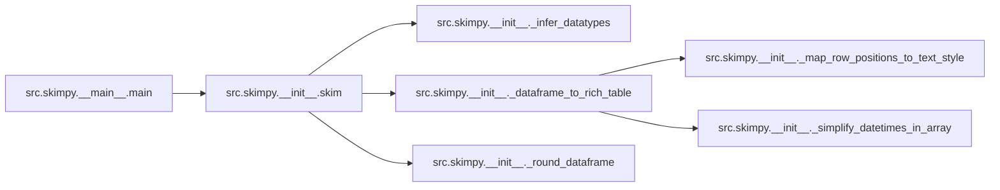

# Src Skimpy Main

[_Documentation generated by Documatic_](https://www.documatic.com)

<!---Documatic-section-Codebase Structure-start--->
## Codebase Structure

<!---Documatic-block-system_architecture-start--->

<!---Documatic-block-system_architecture-end--->

# #
<!---Documatic-section-Codebase Structure-end--->

<!---Documatic-section-src.skimpy.__main__.main-start--->
## src.skimpy.__main__.main

<!---Documatic-section-main-start--->


### Object Calls

* src.skimpy.__init__.skim

<!---Documatic-block-src.skimpy.__main__.main-start--->
<details>
	<summary><code>src.skimpy.__main__.main</code> code snippet</summary>

```python
@click.command()
@click.version_option()
@click.argument('input')
def main(input) -> None:
    df = pd.read_csv(input, infer_datetime_format=True, parse_dates=True)
    df = df.infer_objects()
    skim(df)
```
</details>
<!---Documatic-block-src.skimpy.__main__.main-end--->
<!---Documatic-section-main-end--->

# #
<!---Documatic-section-src.skimpy.__main__.main-end--->

[_Documentation generated by Documatic_](https://www.documatic.com)