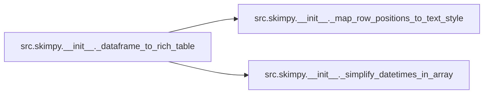
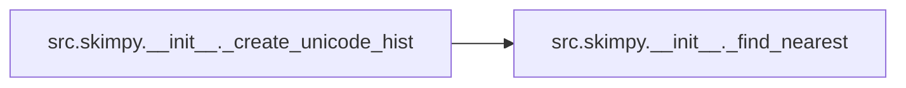
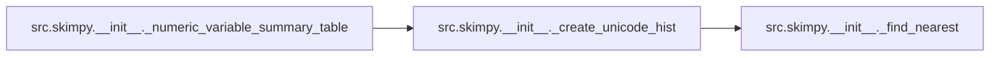
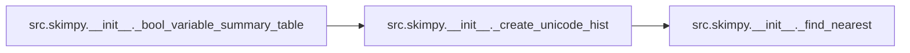
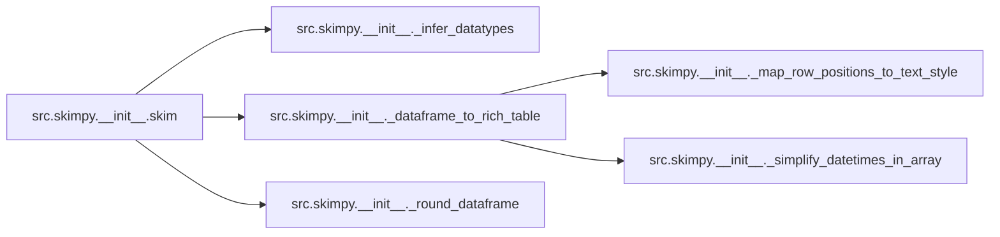
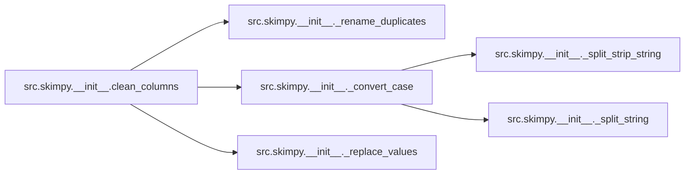
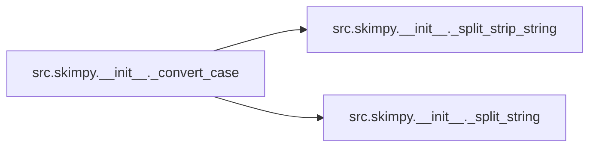

# Src Skimpy Init

[_Documentation generated by Documatic_](https://www.documatic.com)

<!---Documatic-section-Codebase Structure-start--->
## Codebase Structure

<!---Documatic-block-system_architecture-start--->
```mermaid
None
```
<!---Documatic-block-system_architecture-end--->

# #
<!---Documatic-section-Codebase Structure-end--->

<!---Documatic-section-src.skimpy.__init__._infer_datatypes-start--->
## src.skimpy.__init__._infer_datatypes

<!---Documatic-section-_infer_datatypes-start--->
<!---Documatic-block-src.skimpy.__init__._infer_datatypes-start--->
<details>
	<summary><code>src.skimpy.__init__._infer_datatypes</code> code snippet</summary>

```python
@typechecked
def _infer_datatypes(df: pd.DataFrame) -> pd.DataFrame:
    df_types = pd.DataFrame(df.apply(pd.api.types.infer_dtype, axis=0)).reset_index().rename(columns={'index': 'column', 0: 'type'})
    loop_types = df_types.values.tolist()
    for col in loop_types:
        if col[1] == 'string':
            data_type = 'string'
        elif col[1] == 'integer':
            data_type = 'int'
        elif col[1] == 'floating':
            data_type = 'float64'
        elif col[1] == 'datetime64':
            data_type = 'datetime64'
        elif col[1] == 'categorical':
            data_type = 'category'
        elif col[1] == 'boolean':
            data_type = 'bool'
        else:
            data_type = col[1]
        df[col[0]] = df[col[0]].astype(data_type)
    return df
```
</details>
<!---Documatic-block-src.skimpy.__init__._infer_datatypes-end--->
<!---Documatic-section-_infer_datatypes-end--->

# #
<!---Documatic-section-src.skimpy.__init__._infer_datatypes-end--->

<!---Documatic-section-src.skimpy.__init__._round_dataframe-start--->
## src.skimpy.__init__._round_dataframe

<!---Documatic-section-_round_dataframe-start--->
<!---Documatic-block-src.skimpy.__init__._round_dataframe-start--->
<details>
	<summary><code>src.skimpy.__init__._round_dataframe</code> code snippet</summary>

```python
@typechecked
def _round_dataframe(df: pd.DataFrame) -> pd.DataFrame:
    for col in df.select_dtypes('number'):
        df[col] = df[col].apply(lambda x: float(f"{float(f'{x:.2g}'):g}"))
    return df
```
</details>
<!---Documatic-block-src.skimpy.__init__._round_dataframe-end--->
<!---Documatic-section-_round_dataframe-end--->

# #
<!---Documatic-section-src.skimpy.__init__._round_dataframe-end--->

<!---Documatic-section-src.skimpy.__init__._map_row_positions_to_text_style-start--->
## src.skimpy.__init__._map_row_positions_to_text_style

<!---Documatic-section-_map_row_positions_to_text_style-start--->
<!---Documatic-block-src.skimpy.__init__._map_row_positions_to_text_style-start--->
<details>
	<summary><code>src.skimpy.__init__._map_row_positions_to_text_style</code> code snippet</summary>

```python
@typechecked
def _map_row_positions_to_text_style(types_to_property: dict, df: pd.DataFrame) -> dict:
    cols_to_cat_map = dict(zip(types_to_property.keys(), [list(df.select_dtypes(entry).columns) for entry in types_to_property.keys()]))
    type_by_col_default = defaultdict(list)
    for (k, seq) in cols_to_cat_map.items():
        for letter in seq:
            type_by_col_default[letter].append(k)
    type_by_col = dict(zip(type_by_col_default.keys(), [x[0] for x in type_by_col_default.values()]))
    type_to_prop = dict(zip(type_by_col.keys(), [types_to_property[x] for x in type_by_col.values()]))
    columns = list(df.columns)
    row_pos_to_property = dict(zip(range(len(columns)), [type_to_prop[x] for x in columns]))
    return row_pos_to_property
```
</details>
<!---Documatic-block-src.skimpy.__init__._map_row_positions_to_text_style-end--->
<!---Documatic-section-_map_row_positions_to_text_style-end--->

# #
<!---Documatic-section-src.skimpy.__init__._map_row_positions_to_text_style-end--->

<!---Documatic-section-src.skimpy.__init__._simplify_datetimes_in_array-start--->
## src.skimpy.__init__._simplify_datetimes_in_array

<!---Documatic-section-_simplify_datetimes_in_array-start--->
<!---Documatic-block-src.skimpy.__init__._simplify_datetimes_in_array-start--->
<details>
	<summary><code>src.skimpy.__init__._simplify_datetimes_in_array</code> code snippet</summary>

```python
@typechecked
def _simplify_datetimes_in_array(rows: np.ndarray) -> np.ndarray:
    timestamp_positions = [[[idx, i] for (i, j) in enumerate(item) if type(j) == pd._libs.tslibs.timestamps.Timestamp] for (idx, item) in enumerate(rows)]
    timestamp_pos_list = list(chain.from_iterable(timestamp_positions))
    timestamp_pos_tuples = [tuple(entry) for entry in timestamp_pos_list]
    for entry in timestamp_pos_tuples:
        (hour, min, sec) = (rows[entry].hour, rows[entry].minute, rows[entry].second)
        if hour == min == sec == 0:
            rows[entry] = rows[entry].strftime('%Y-%m-%d')
    return rows
```
</details>
<!---Documatic-block-src.skimpy.__init__._simplify_datetimes_in_array-end--->
<!---Documatic-section-_simplify_datetimes_in_array-end--->

# #
<!---Documatic-section-src.skimpy.__init__._simplify_datetimes_in_array-end--->

<!---Documatic-section-src.skimpy.__init__._dataframe_to_rich_table-start--->
## src.skimpy.__init__._dataframe_to_rich_table

<!---Documatic-section-_dataframe_to_rich_table-start--->


### Object Calls

* src.skimpy.__init__._map_row_positions_to_text_style
* src.skimpy.__init__._simplify_datetimes_in_array

<!---Documatic-block-src.skimpy.__init__._dataframe_to_rich_table-start--->
<details>
	<summary><code>src.skimpy.__init__._dataframe_to_rich_table</code> code snippet</summary>

```python
@typechecked
def _dataframe_to_rich_table(table_name: str, df: pd.DataFrame, number: str='cyan', category: str='magenta', datetime: str='red', string: str='green', bool: str='turquoise2', object: str='medium_purple1') -> rich.table.Table:
    str_limit: int = 20
    df = df.reset_index().rename(columns={'index': 'column_name'})
    table = Table(show_footer=False, expand=True, title=table_name, show_header=True)
    datatype_colours = {'number': number, 'category': category, 'datetime': datetime, 'string': string, 'bool': bool, 'object': object}
    datatype_justify = {'number': 'right', 'category': 'center', 'datetime': 'center', 'string': 'center', 'bool': 'left', 'object': 'left'}
    pos_to_colour = _map_row_positions_to_text_style(datatype_colours, df)
    pos_to_justification = _map_row_positions_to_text_style(datatype_justify, df)
    rows = df.values
    if (DATE_COL_FIRST or DATE_COL_LAST) in df.columns:
        rows = _simplify_datetimes_in_array(rows)
    rows = [[str(s).rstrip('0').rstrip('.') if '.' and type(s) == float else s for s in row] for row in rows]
    for col in df.columns:
        table.add_column(str(col), overflow='fold')
    for row in rows:
        row = [Text(str(item)[:str_limit], style=pos_to_colour[i], justify=pos_to_justification[i]) for (i, item) in enumerate(row)]
        table.add_row(*list(row))
    return table
```
</details>
<!---Documatic-block-src.skimpy.__init__._dataframe_to_rich_table-end--->
<!---Documatic-section-_dataframe_to_rich_table-end--->

# #
<!---Documatic-section-src.skimpy.__init__._dataframe_to_rich_table-end--->

<!---Documatic-section-src.skimpy.__init__._find_nearest-start--->
## src.skimpy.__init__._find_nearest

<!---Documatic-section-_find_nearest-start--->
<!---Documatic-block-src.skimpy.__init__._find_nearest-start--->
<details>
	<summary><code>src.skimpy.__init__._find_nearest</code> code snippet</summary>

```python
def _find_nearest(array, value):
    array = np.asarray(array)
    idx = np.abs(array - value).argmin()
    return array[idx]
```
</details>
<!---Documatic-block-src.skimpy.__init__._find_nearest-end--->
<!---Documatic-section-_find_nearest-end--->

# #
<!---Documatic-section-src.skimpy.__init__._find_nearest-end--->

<!---Documatic-section-src.skimpy.__init__._create_unicode_hist-start--->
## src.skimpy.__init__._create_unicode_hist

<!---Documatic-section-_create_unicode_hist-start--->


### Object Calls

* src.skimpy.__init__._find_nearest

<!---Documatic-block-src.skimpy.__init__._create_unicode_hist-start--->
<details>
	<summary><code>src.skimpy.__init__._create_unicode_hist</code> code snippet</summary>

```python
@typechecked
def _create_unicode_hist(series: pd.Series) -> pd.Series:
    if series.dtype == 'bool':
        series = series.astype('int')
    (hist, _) = np.histogram(series, density=True, bins=HIST_BINS)
    hist = hist / hist.max()
    key_vector = np.array(list(UNICODE_HIST.keys()), dtype='float')
    ucode_to_print = ''.join([UNICODE_HIST[_find_nearest(key_vector, val)] for val in hist])
    return pd.Series(index=[series.name], data=ucode_to_print, dtype='string')
```
</details>
<!---Documatic-block-src.skimpy.__init__._create_unicode_hist-end--->
<!---Documatic-section-_create_unicode_hist-end--->

# #
<!---Documatic-section-src.skimpy.__init__._create_unicode_hist-end--->

<!---Documatic-section-src.skimpy.__init__._numeric_variable_summary_table-start--->
## src.skimpy.__init__._numeric_variable_summary_table

<!---Documatic-section-_numeric_variable_summary_table-start--->


### Object Calls

* src.skimpy.__init__._create_unicode_hist

<!---Documatic-block-src.skimpy.__init__._numeric_variable_summary_table-start--->
<details>
	<summary><code>src.skimpy.__init__._numeric_variable_summary_table</code> code snippet</summary>

```python
@typechecked
def _numeric_variable_summary_table(xf: pd.DataFrame) -> pd.DataFrame:
    count_nans_vec = xf.isna().sum()
    data_dict = {MISSING_COL: count_nans_vec, COMPLETE_COL: 100 * count_nans_vec / xf.shape[0], NUM_COL_MEAN: xf.mean(), 'sd': xf.std()}
    display_quantiles_as_pct = 100
    quantiles_dict = dict(zip(['p' + str(int(x * display_quantiles_as_pct)) for x in QUANTILES], [xf.quantile(x) for x in QUANTILES]))
    data_dict.update(quantiles_dict)
    hist_series = pd.concat([_create_unicode_hist(xf[col].dropna()) for col in xf.columns], axis=0)
    data_dict.update({'hist': hist_series})
    summary_df = pd.DataFrame(data_dict)
    return summary_df
```
</details>
<!---Documatic-block-src.skimpy.__init__._numeric_variable_summary_table-end--->
<!---Documatic-section-_numeric_variable_summary_table-end--->

# #
<!---Documatic-section-src.skimpy.__init__._numeric_variable_summary_table-end--->

<!---Documatic-section-src.skimpy.__init__._category_variable_summary_table-start--->
## src.skimpy.__init__._category_variable_summary_table

<!---Documatic-section-_category_variable_summary_table-start--->
<!---Documatic-block-src.skimpy.__init__._category_variable_summary_table-start--->
<details>
	<summary><code>src.skimpy.__init__._category_variable_summary_table</code> code snippet</summary>

```python
@typechecked
def _category_variable_summary_table(xf: pd.DataFrame) -> pd.DataFrame:
    count_nans_vec = xf.isna().sum()
    data_dict = {MISSING_COL: count_nans_vec, COMPLETE_COL: 100 * count_nans_vec / xf.shape[0], 'ordered': pd.Series(dict(zip(xf.columns, [xf[col].cat.ordered for col in xf.columns]))), 'unique': pd.Series(dict(zip(xf.columns, [len(xf[col].unique()) for col in xf.columns])))}
    summary_df = pd.DataFrame(data_dict)
    return summary_df
```
</details>
<!---Documatic-block-src.skimpy.__init__._category_variable_summary_table-end--->
<!---Documatic-section-_category_variable_summary_table-end--->

# #
<!---Documatic-section-src.skimpy.__init__._category_variable_summary_table-end--->

<!---Documatic-section-src.skimpy.__init__._bool_variable_summary_table-start--->
## src.skimpy.__init__._bool_variable_summary_table

<!---Documatic-section-_bool_variable_summary_table-start--->


### Object Calls

* src.skimpy.__init__._create_unicode_hist

<!---Documatic-block-src.skimpy.__init__._bool_variable_summary_table-start--->
<details>
	<summary><code>src.skimpy.__init__._bool_variable_summary_table</code> code snippet</summary>

```python
@typechecked
def _bool_variable_summary_table(xf: pd.DataFrame) -> pd.DataFrame:
    data_dict = {'true': xf.sum(), 'true rate': xf.sum() / xf.shape[0]}
    hist_series = pd.concat([_create_unicode_hist(xf[col].dropna()) for col in xf.columns], axis=0)
    data_dict.update({'hist': hist_series})
    summary_df = pd.DataFrame(data_dict)
    return summary_df
```
</details>
<!---Documatic-block-src.skimpy.__init__._bool_variable_summary_table-end--->
<!---Documatic-section-_bool_variable_summary_table-end--->

# #
<!---Documatic-section-src.skimpy.__init__._bool_variable_summary_table-end--->

<!---Documatic-section-src.skimpy.__init__._string_variable_summary_table-start--->
## src.skimpy.__init__._string_variable_summary_table

<!---Documatic-section-_string_variable_summary_table-start--->
<!---Documatic-block-src.skimpy.__init__._string_variable_summary_table-start--->
<details>
	<summary><code>src.skimpy.__init__._string_variable_summary_table</code> code snippet</summary>

```python
@typechecked
def _string_variable_summary_table(xf: pd.DataFrame) -> pd.DataFrame:
    count_nans_vec = xf.isna().sum()
    data_dict = {MISSING_COL: count_nans_vec, COMPLETE_COL: 100 * count_nans_vec / xf.shape[0], 'words per row': pd.Series(dict(zip(xf.columns, [xf[xf.columns[0]].str.count(' ').add(1).sum() / len(xf) for col in xf.columns]))), 'total words': pd.Series(dict(zip(xf.columns, [xf[xf.columns[0]].str.count(' ').add(1).sum() for col in xf.columns])))}
    summary_df = pd.DataFrame(data_dict)
    return summary_df
```
</details>
<!---Documatic-block-src.skimpy.__init__._string_variable_summary_table-end--->
<!---Documatic-section-_string_variable_summary_table-end--->

# #
<!---Documatic-section-src.skimpy.__init__._string_variable_summary_table-end--->

<!---Documatic-section-src.skimpy.__init__._datetime_variable_summary_table-start--->
## src.skimpy.__init__._datetime_variable_summary_table

<!---Documatic-section-_datetime_variable_summary_table-start--->
<!---Documatic-block-src.skimpy.__init__._datetime_variable_summary_table-start--->
<details>
	<summary><code>src.skimpy.__init__._datetime_variable_summary_table</code> code snippet</summary>

```python
@typechecked
def _datetime_variable_summary_table(xf: pd.DataFrame) -> pd.DataFrame:
    count_nans_vec = xf.isna().sum()
    data_dict = {MISSING_COL: count_nans_vec, COMPLETE_COL: 100 * count_nans_vec / xf.shape[0], DATE_COL_FIRST: pd.Series(dict(zip(xf.columns, [xf[col].min() for col in xf.columns]))), DATE_COL_LAST: pd.Series(dict(zip(xf.columns, [xf[col].max() for col in xf.columns])))}
    if len(xf) > 3:
        data_dict.update({'frequency': pd.Series(dict(zip(xf.columns, [pd.infer_freq(xf[col]) for col in xf.columns])))})
    summary_df = pd.DataFrame(data_dict)
    return summary_df
```
</details>
<!---Documatic-block-src.skimpy.__init__._datetime_variable_summary_table-end--->
<!---Documatic-section-_datetime_variable_summary_table-end--->

# #
<!---Documatic-section-src.skimpy.__init__._datetime_variable_summary_table-end--->

<!---Documatic-section-src.skimpy.__init__.skim-start--->
## src.skimpy.__init__.skim

<!---Documatic-section-skim-start--->


### Object Calls

* src.skimpy.__init__._infer_datatypes
* src.skimpy.__init__._dataframe_to_rich_table
* src.skimpy.__init__._round_dataframe

<!---Documatic-block-src.skimpy.__init__.skim-start--->
<details>
	<summary><code>src.skimpy.__init__.skim</code> code snippet</summary>

```python
@typechecked
def skim(df: pd.DataFrame, header_style: str='bold cyan', **colour_kwargs: str) -> None:
    if hasattr(df, 'name') and 'name' not in df.columns:
        name = df.name
    else:
        name = 'dataframe'
    df = _infer_datatypes(df)
    tab_1_data = {'Number of rows': df.shape[0], 'Number of columns': df.shape[1]}
    dat_sum_table = Table(title='Data Summary', show_header=True, header_style=header_style)
    dat_sum_table.add_column(name)
    dat_sum_table.add_column('Values')
    for (key, val) in tab_1_data.items():
        dat_sum_table.add_row(key, str(val))
    types_sum_table = Table(title='Data Types', show_header=True, header_style=header_style)
    tab_2_data = df.dtypes.astype(str).value_counts().to_dict()
    types_sum_table.add_column('Column Type')
    types_sum_table.add_column('Count')
    for (key, val) in tab_2_data.items():
        types_sum_table.add_row(key, str(val))
    if 'category' in df.dtypes.astype(str).to_list():
        xf = pd.DataFrame(df.dtypes.astype(str))
        cat_sum_table = Table(title='Categories', show_header=True, header_style=header_style)
        header_string = f'[{header_style}]Categorical Variables[/{header_style}]'
        cat_sum_table.add_column(header_string)
        cat_names = list(xf[xf[0] == 'category'].index)
        for cat in cat_names:
            cat_sum_table.add_row(cat)
    types_funcs_dict = {'number': _numeric_variable_summary_table, 'category': _category_variable_summary_table, 'datetime': _datetime_variable_summary_table, 'string': _string_variable_summary_table, 'bool': _bool_variable_summary_table}
    list_of_tabs = []
    for (col_type, summary_func) in types_funcs_dict.items():
        xf = df.select_dtypes(col_type)
        if not xf.empty:
            sum_df = summary_func(xf)
            list_of_tabs.append(_dataframe_to_rich_table(col_type, _round_dataframe(sum_df)))
    grid = Table.grid(expand=True)
    tables_list = [dat_sum_table, types_sum_table]
    if 'category' in df.dtypes.astype(str).to_list():
        tables_list.append(cat_sum_table)
    grid.add_row(Columns(tables_list))
    grid.add_column(justify='left')
    for sum_tab in list_of_tabs:
        grid.add_row(sum_tab)
    grid.add_row(list_of_tabs[-1])
    console.print(Panel(grid, title='skimpy summary', subtitle='End'))
```
</details>
<!---Documatic-block-src.skimpy.__init__.skim-end--->
<!---Documatic-section-skim-end--->

# #
<!---Documatic-section-src.skimpy.__init__.skim-end--->

<!---Documatic-section-src.skimpy.__init__.clean_columns-start--->
## src.skimpy.__init__.clean_columns

<!---Documatic-section-clean_columns-start--->


### Object Calls

* src.skimpy.__init__._rename_duplicates
* src.skimpy.__init__._convert_case
* src.skimpy.__init__._replace_values

<!---Documatic-block-src.skimpy.__init__.clean_columns-start--->
<details>
	<summary><code>src.skimpy.__init__.clean_columns</code> code snippet</summary>

```python
@typechecked
def clean_columns(df: pd.DataFrame, case: str='snake', replace: Optional[Dict[str, str]]=None, remove_accents: bool=True) -> pd.DataFrame:
    if case not in CASE_STYLES:
        raise ValueError(f"case {case} is invalid, options are: {', '.join((c for c in CASE_STYLES))}")
    orig_columns = df.columns.astype(str).tolist()
    if replace:
        df = df.rename(columns=lambda col: _replace_values(col, replace))
    if remove_accents:
        df = df.rename(columns=_remove_accents)
    df = df.rename(columns=lambda col: _convert_case(col, case))
    df.columns = _rename_duplicates(df.columns, case)
    new_columns = df.columns.astype(str).tolist()
    cleaned = [1 if new_columns[i] != orig_columns[i] else 0 for i in range(len(orig_columns))]
    print(f'{sum(cleaned)} column names have been cleaned')
    return df
```
</details>
<!---Documatic-block-src.skimpy.__init__.clean_columns-end--->
<!---Documatic-section-clean_columns-end--->

# #
<!---Documatic-section-src.skimpy.__init__.clean_columns-end--->

<!---Documatic-section-src.skimpy.__init__._convert_case-start--->
## src.skimpy.__init__._convert_case

<!---Documatic-section-_convert_case-start--->


### Object Calls

* src.skimpy.__init__._split_strip_string
* src.skimpy.__init__._split_string

<!---Documatic-block-src.skimpy.__init__._convert_case-start--->
<details>
	<summary><code>src.skimpy.__init__._convert_case</code> code snippet</summary>

```python
@typechecked
def _convert_case(name: Any, case: str) -> Any:
    if name in NULL_VALUES:
        name = 'header'
    if case in {'snake', 'kebab', 'camel', 'pascal', 'const'}:
        words = _split_strip_string(str(name))
    else:
        words = _split_string(str(name))
    if case == 'snake':
        name = '_'.join(words).lower()
    elif case == 'kebab':
        name = '-'.join(words).lower()
    elif case == 'camel':
        name = words[0].lower() + ''.join((w.capitalize() for w in words[1:]))
    elif case == 'pascal':
        name = ''.join((w.capitalize() for w in words))
    elif case == 'const':
        name = '_'.join(words).upper()
    elif case == 'sentence':
        name = ' '.join(words).capitalize()
    elif case == 'title':
        name = ' '.join((w.capitalize() for w in words))
    elif case == 'lower':
        name = ' '.join(words).lower()
    elif case == 'upper':
        name = ' '.join(words).upper()
    return name
```
</details>
<!---Documatic-block-src.skimpy.__init__._convert_case-end--->
<!---Documatic-section-_convert_case-end--->

# #
<!---Documatic-section-src.skimpy.__init__._convert_case-end--->

<!---Documatic-section-src.skimpy.__init__._split_strip_string-start--->
## src.skimpy.__init__._split_strip_string

<!---Documatic-section-_split_strip_string-start--->
<!---Documatic-block-src.skimpy.__init__._split_strip_string-start--->
<details>
	<summary><code>src.skimpy.__init__._split_strip_string</code> code snippet</summary>

```python
@typechecked
def _split_strip_string(string: str) -> List[str]:
    string = re.sub('[!()*+\\,\\-./:;<=>?[\\]^_{|}~]', ' ', string)
    string = re.sub('[\\\'\\"\\`]', '', string)
    return re.sub('([A-Z][a-z]+)', ' \\1', re.sub('([A-Z]+|[0-9]+|\\W+)', ' \\1', string)).split()
```
</details>
<!---Documatic-block-src.skimpy.__init__._split_strip_string-end--->
<!---Documatic-section-_split_strip_string-end--->

# #
<!---Documatic-section-src.skimpy.__init__._split_strip_string-end--->

<!---Documatic-section-src.skimpy.__init__._split_string-start--->
## src.skimpy.__init__._split_string

<!---Documatic-section-_split_string-start--->
<!---Documatic-block-src.skimpy.__init__._split_string-start--->
<details>
	<summary><code>src.skimpy.__init__._split_string</code> code snippet</summary>

```python
@typechecked
def _split_string(string: str) -> List[str]:
    string = re.sub('[\\-_]', ' ', string)
    return re.sub('([A-Z][a-z]+)', ' \\1', re.sub('([A-Z]+)', '\\1', string)).split()
```
</details>
<!---Documatic-block-src.skimpy.__init__._split_string-end--->
<!---Documatic-section-_split_string-end--->

# #
<!---Documatic-section-src.skimpy.__init__._split_string-end--->

<!---Documatic-section-src.skimpy.__init__._replace_values-start--->
## src.skimpy.__init__._replace_values

<!---Documatic-section-_replace_values-start--->
<!---Documatic-block-src.skimpy.__init__._replace_values-start--->
<details>
	<summary><code>src.skimpy.__init__._replace_values</code> code snippet</summary>

```python
@typechecked
def _replace_values(name: Any, mapping: Dict[str, str]) -> Any:
    if name in NULL_VALUES:
        return name
    name = str(name)
    for (old_value, new_value) in mapping.items():
        new_val = f'{new_value}' if old_value.isalnum() and new_value.isalnum() else f'_{new_value}_'
        name = re.sub(f'{old_value}', new_val, name, flags=re.IGNORECASE)
    return name
```
</details>
<!---Documatic-block-src.skimpy.__init__._replace_values-end--->
<!---Documatic-section-_replace_values-end--->

# #
<!---Documatic-section-src.skimpy.__init__._replace_values-end--->

<!---Documatic-section-src.skimpy.__init__._remove_accents-start--->
## src.skimpy.__init__._remove_accents

<!---Documatic-section-_remove_accents-start--->
<!---Documatic-block-src.skimpy.__init__._remove_accents-start--->
<details>
	<summary><code>src.skimpy.__init__._remove_accents</code> code snippet</summary>

```python
@typechecked
def _remove_accents(name: Any) -> Any:
    if not isinstance(name, str):
        return name
    return normalize('NFD', name).encode('ascii', 'ignore').decode('ascii')
```
</details>
<!---Documatic-block-src.skimpy.__init__._remove_accents-end--->
<!---Documatic-section-_remove_accents-end--->

# #
<!---Documatic-section-src.skimpy.__init__._remove_accents-end--->

<!---Documatic-section-src.skimpy.__init__._rename_duplicates-start--->
## src.skimpy.__init__._rename_duplicates

<!---Documatic-section-_rename_duplicates-start--->
<!---Documatic-block-src.skimpy.__init__._rename_duplicates-start--->
<details>
	<summary><code>src.skimpy.__init__._rename_duplicates</code> code snippet</summary>

```python
@typechecked
def _rename_duplicates(names: pd.Index, case: str) -> Any:
    if case in {'snake', 'const'}:
        sep = '_'
    elif case in {'camel', 'pascal'}:
        sep = ''
    elif case == 'kebab':
        sep = '-'
    else:
        sep = ' '
    names = list(names)
    counts: Dict[str, int] = {}
    for (i, col) in enumerate(names):
        cur_count = counts.get(col, 0)
        if cur_count > 0:
            names[i] = f'{col}{sep}{cur_count}'
        counts[col] = cur_count + 1
    return names
```
</details>
<!---Documatic-block-src.skimpy.__init__._rename_duplicates-end--->
<!---Documatic-section-_rename_duplicates-end--->

# #
<!---Documatic-section-src.skimpy.__init__._rename_duplicates-end--->

<!---Documatic-section-src.skimpy.__init__.generate_test_data-start--->
## src.skimpy.__init__.generate_test_data

<!---Documatic-section-generate_test_data-start--->
<!---Documatic-block-src.skimpy.__init__.generate_test_data-start--->
<details>
	<summary><code>src.skimpy.__init__.generate_test_data</code> code snippet</summary>

```python
@typechecked
def generate_test_data() -> pd.DataFrame:
    seed = 34729
    rng = Generator(PCG64(seed))
    len_df = 1000
    df = pd.DataFrame()
    df['length'] = rng.beta(0.5, 0.5, size=len_df)
    df['width'] = rng.gamma(1, 2, size=len_df)
    df['depth'] = rng.poisson(10, size=len_df)
    df['rnd'] = rng.normal(size=len_df, scale=1, loc=0)
    nan_places = rng.choice(range(len_df), size=125)
    df.loc[nan_places, 'rnd'] = np.nan
    df['class'] = rng.choice(['setosa', 'virtginica'], size=len_df)
    df['class'] = df['class'].astype('category')
    second_cat_var_entries = ['UK', 'Mexico', 'USA', 'India']
    prob = [0.6, 0.2, 0.1, 0.1]
    df['location'] = rng.choice(second_cat_var_entries, len_df, p=prob)
    df['location'] = df['location'].astype('category')
    df.loc[3, 'location'] = np.nan
    df['booly_col'] = rng.choice([True, False], size=len_df)
    df['booly_col'] = df['booly_col'].astype(bool)
    string_options = ['How are you?', 'What weather!', 'Indeed, it was the most outrageously pompous cat I have ever seen.']
    df['text'] = rng.choice(string_options, len_df)
    df.loc[[3, 5, 8, 9, 14, 22], 'text'] = None
    df['text'] = df['text'].astype('string')
    df['date'] = pd.date_range('2018-01-01', periods=len_df, freq='M')
    df['date_no_freq'] = rng.choice(pd.to_datetime(pd.Series(['01/01/2022', '03/04/2023', '01/05/1992'])), len_df)
    df.loc[[3, 12, 0], 'date_no_freq'] = pd.NaT
    return df
```
</details>
<!---Documatic-block-src.skimpy.__init__.generate_test_data-end--->
<!---Documatic-section-generate_test_data-end--->

# #
<!---Documatic-section-src.skimpy.__init__.generate_test_data-end--->

[_Documentation generated by Documatic_](https://www.documatic.com)